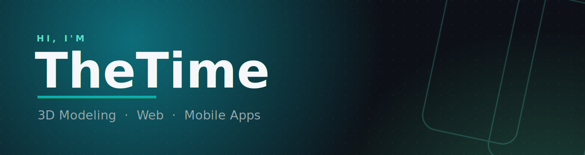
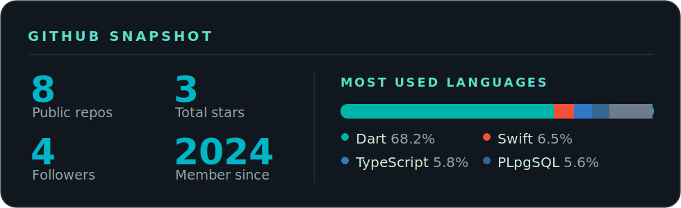

 

**I build visually appealing, functional digital products — from 3D scenes to full-stack web and cross-platform mobile apps.**

---

## 🚀 About me

- 🎨 **3D artist** in **Blender** — models & renders
- 💻 **Full-stack web developer** — frontend & backend
- 📱 **Mobile app developer** with **Flutter** — shipping **Material 3** apps on Android
- ⚡ Obsessed with **clean design**, smooth motion and performance

---

## 🛠️ Tech &amp; Tools

**Languages**

**Mobile**

**Web**

**Backend &amp; Infra**

**Design &amp; 3D**

**Tools**

---

## 📦 Projects

<table>
<tr>
<td width="50%" valign="top">

### 🎬 Kadr
Movie &amp; TV tracker in **Material 3 Expressive** — bold design, rich stats, Trakt sync, Android TV. Local-first, open source.

</td>
<td width="50%" valign="top">

### 🌿 Fern
Beautiful **language flashcards** — offline-first, FSRS spaced repetition, learn words from videos, books &amp; photos.

</td>
</tr>
<tr>
<td width="50%" valign="top">

### 💞 Togetherly
A cozy app **for couples** — shared moments, home-screen widgets, live map, achievements &amp; time capsules. Open source.

</td>
<td width="50%" valign="top">

### 🕯️ Wickly
A private **journal** — no account, on-device encryption, P2P sync between your own devices, 7 languages. FOSS.

</td>
</tr>
<tr>
<td width="50%" valign="top">

### 🃏 ScoreMaster
A clean **card-game score counter** — rounds, players, session history, stats &amp; achievements.

</td>
<td width="50%" valign="top">

### 📊 Review Hub
A **SaaS for review analytics** built with **Next.js** — insights, AI-drafted replies &amp; weekly reports. Live in production.

</td>
</tr>
<tr>
<td colspan="2" valign="top">

### ➕ More
The rest of my work lives on my repositories tab.

</td>
</tr>
</table>

---

## 📊 GitHub

---

## 👥 Team · S&amp;T Company

Building apps together as **S&amp;T Company**

| | |
|:--|:--|
| [**THET1ME-1**](https://github.com/THET1ME-1) | founder · lead dev |
| [**JbSharan2**](https://github.com/JbSharan2) | co-founder |

 

